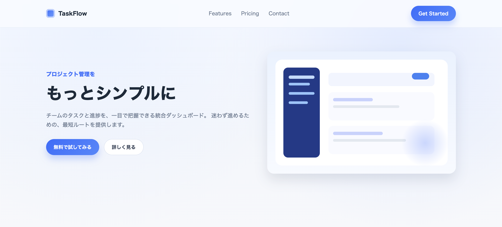
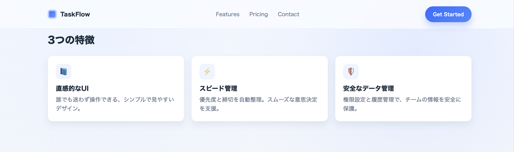
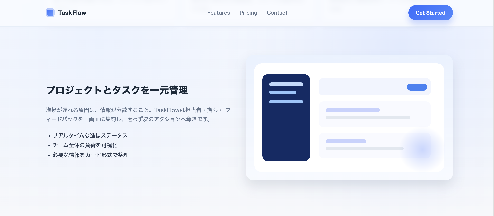
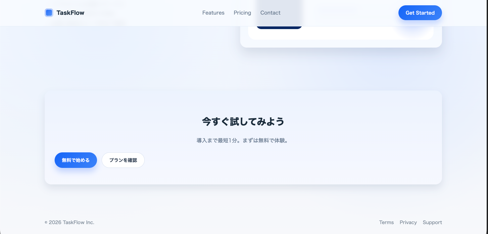
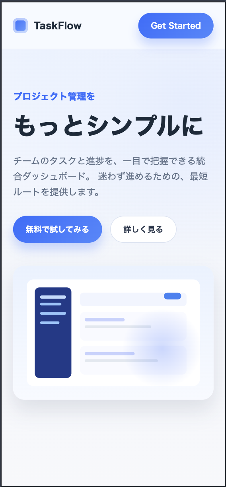

# cw-sample-02-design-to-lp

デザイン（スクリーンショット）を元に、1ページLPを **HTML/CSSで忠実に再現**したサンプルです。  
**レスポンシブ対応（PC/SP）**・固定ヘッダーのアンカー見切れ対策も実装しています。

---

## Demo
- GitHub Pages：https://aoiishikawa1818.github.io/cw-sample-02-design-to-lp/

---

## Screenshots（デザイン参照）
※再現対象として使用したスクリーンショットです。

### PC（上部）


### PC（中部1）


### PC（中部2）


### PC（下部）


### SP（ファーストビュー）


---

## What I Built（このサンプルでやったこと）
- 画像デザインを読み取り、セクション構成を整理してLPを再現
- レスポンシブ対応（PC / Tablet / SP）
- UI品質の調整（余白、文字サイズ、角丸、影、ボタンの状態）
- **固定ヘッダー + アンカーリンクの見切れ対策**
  - `scroll-padding-top` / `scroll-margin-top` を利用して、`#features` 等への移動で見出しが隠れないように調整

---

## Tech Stack
- HTML
- CSS（バニラ）
- JavaScript（必要最小限 / ない場合もあり）

---

## Folder Structure
```text
.
├── index.html
├── styles.css
├── script.js          (optional)
└── assets/
    └── ref/
        ├── ref_pc_top.png
        ├── ref_pc_mid1.png
        ├── ref_pc_mid2.png
        ├── ref_pc_bottom.png
        └── ref_sp_hero.png
```
---

## How to Run（ローカルでの確認）
### いちばん簡単
- `index.html` をブラウザで開くだけでOKです。

### 任意：簡易サーバーで開く（相対パス確認を安定させたい場合）
- Node.js がある場合：
```bash
npx serve .
```
---

## Notes（メモ）

- 固定ヘッダー + アンカーリンクの見切れ対策として、`scroll-padding-top` と `scroll-margin-top` を適用しています。
- ボタン文言などの微修正は `index.html` を編集して反映しています。

---

## License
本プロジェクトは MIT ライセンスの下で公開されています。